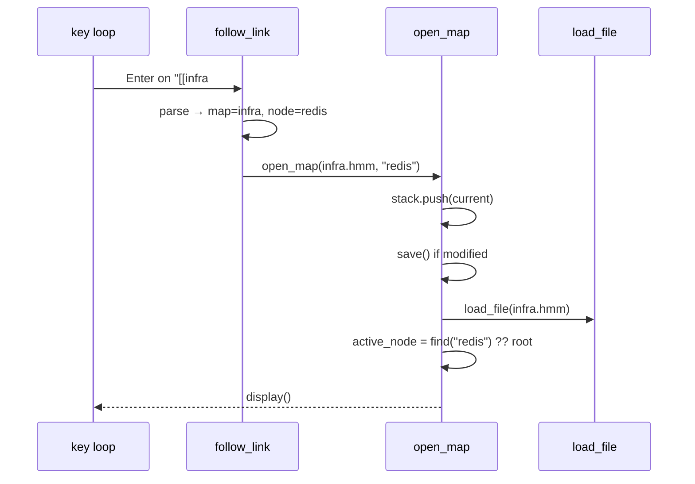

# Architecture

One PHP file, one global `$mm`, flat functions, a key → function table. Same as upstream. Additions only.

## State (added to `$mm`)
```
mode   : 'list' | 'map'
stack  : [{file, active_node, viewport_top, viewport_left}]   # nav history, memory only
list   : {items, filter, cursor}
nodes[id].body : string                                       # only new node field
```

## Flow
```
main
  args.file ? mode=map : mode=list
  loop
    mode == list → list_screen()      # own key loop, returns file or null
    mode == map  → existing key loop
                    Enter     → follow_link() | insert_new_sibling()
                    Backspace → go_back()
                    ctrl+e    → extract_to_map()
                    E         → edit_body()
                    q         → save-if-modified, mode=list
```

## Functions
| fn | does | ~lines |
|---|---|---|
| `list_screen()` | scan dir, filter, draw, key loop | 90 |
| `open_map(file, node?)` | push stack, save if modified, `load_file`, jump to node | 30 |
| `follow_link()` | parse `[[..]]` from title then body; confirm-create if missing | 30 |
| `go_back()` | pop stack, reload, restore position | 15 |
| `extract_to_map()` | subtree → file via serializer, title → `[[key]]`, drop children | 40 |
| `edit_body()` | tmp file, `$EDITOR`, reparse, mark modified | 30 |
| `detail_pane()` | draw body in bottom rows, called from `display()` | 30 |
| `rename_map()` | mv, `sed -i` inbound links, report | 15 |
| `display()` Δ | colour links, `…` marker, reserve pane rows | 15 |
| `load_file()` / `save()` Δ | `> ` body lines in and out | 25 |

## Sequence: follow a link


## Invariants
- `$mm['nodes']` holds exactly one map. Never two.
- The file on disk is the truth. Task status, link targets, node counts are recomputed on load, never cached.
- Every write to disk goes through `save()`. Extract and rename are the only functions that write other files.
- Taskwarrior is read-only until stage B. hmm never mutates task state in stage A.
